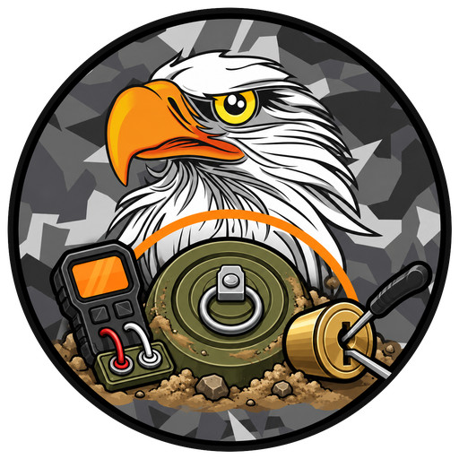

  

<h1 align="center">TLB Interactions</h1>

  Hands-on defusal and lockpicking for Arma 3 with ACE3. 
  <strong>No more progress bars.</strong>

  <a href="docs/defusal.md">Defusal guide</a> ·
  <a href="docs/lockpicking.md">Lockpicking &amp; doors</a> ·
  <a href="docs/settings.md">All settings</a> ·
  <a href="docs/how-it-works.md">How it works</a> ·
  <a href="docs/building.md">Building</a>

---

## What it is

TLB Interactions turns two of ACE's waiting-for-a-bar moments into things you
actually do — and can get wrong.

**Defusal.** Using ACE's *Defuse* action no longer runs a timer. It opens a
board showing the device in front of you, and what you do depends on what it is:

| Device | What you do |
| --- | --- |
| **IED** — wired devices, and anything remote, timed, magnetic or IR | Brush the soil off, cut away the tape, find the firing line with a meter (volts and continuity), cut it. |
| **Mine** — pressure and proximity mines, AP and AT | Prod the soil to find it, dig out the rim without touching the pressure plate, seat the safety pin with a steady hand. |
| **Tripwire** — tripwire mines and flares | Part the grass to trace the whole wire (it may branch to a second device), check the tension, pin, cut. |

It replaces ACE's defusal rather than adding new explosives, so it works on
**every** mine and explosive ACE can already defuse — vanilla, ACE, RHS, CUP,
mission-placed or Zeus-placed.

**Lockpicking.** Locked doors are picked on a board with a **lock pick kit** or a
**paperclip**. Each lock rolls one of three techniques — pin tumbler, rake or
sweet spot — and a paperclip bends with every mistake and snaps on the third.
Doors always work: with **tsp_breach** loaded its door system is used; without
it, TLB Interactions runs its own door menu and random door locking.

Everything is configurable through CBA settings, down to separate difficulty
levels for each lockpicking technique with each tool.

## Requirements

| | |
| --- | --- |
| Arma 3 | v2.14 or newer |
| [CBA_A3](https://steamcommunity.com/workshop/filedetails/?id=450814997) | required |
| [ACE3](https://steamcommunity.com/workshop/filedetails/?id=463939057) | required |
| tsp_breach | optional — its door actions, locking and items are used when loaded |

## Installation

1. Build the mod (see [Building](docs/building.md)) or take a release build.
2. Put the `@TLB Interactions` folder in your Arma 3 directory or mod folder.
3. Load it together with CBA_A3 and ACE3.
4. On a server, load it on the server **and** every client — all settings are
   server-forced, and the boards run on the client.

## Quick start

**Defusing:** walk up to an explosive with ACE's defusal kit and use *Defuse* as
usual. Read the board's title — **IED**, **Mine** or **Tripwire** — and follow
that procedure. Everything you finish stays done on the device, so you can back
off and come back, or hand it to a team mate. Full walkthrough:
[Defusal guide](docs/defusal.md).

**Picking a lock:** carry a lock pick kit or a paperclip, open the ACE
interaction menu at a locked door and choose *Pick lock* (or tsp_breach's *Use
Lockpick* / *Use Paperclip*). Controls on the board: <kbd>A</kbd>/<kbd>D</kbd> to
move, hold <kbd>W</kbd> or <kbd>Space</kbd>, <kbd>R</kbd> to rake, <kbd>Esc</kbd>
to back away. Full walkthrough: [Lockpicking & doors](docs/lockpicking.md).

**Configuring:** *Options → Addon Options → TLB Interactions*. Every setting,
its default and its range: [All settings](docs/settings.md).

## Documentation

| Page | For |
| --- | --- |
| [Defusal guide](docs/defusal.md) | Players — every stage of the IED, mine and tripwire procedures, what the readings mean, what kills you. |
| [Lockpicking & doors](docs/lockpicking.md) | Players — tools, the three techniques, door classes, the door menu without tsp_breach. |
| [All settings](docs/settings.md) | Mission makers and server admins — every CBA setting with its default, range and effect, and the difficulty tables. |
| [How it works](docs/how-it-works.md) | Developers — how ACE is hooked, how devices and locks are generated, synced and drawn, how tsp_breach is taken over. |
| [Building](docs/building.md) | Developers — building PBOs, regenerating textures, signing, repository layout. |

## Compatibility

- Hooks ACE's own defuse interaction and keeps its name, icon, condition and
  distance. `ace_explosives_defuseStart` fires when a board opens and a correct
  cut ends in ACE's own defusal, so anything listening to ACE's events keeps
  working.
- AI defusing on their own, and the mod switched off in its settings, use ACE's
  original behaviour.
- **tsp_breach:** detected automatically. Its door actions and locking stay in
  charge, and its lockpicking opens this board. Without it, the built-in door
  system takes over. The two never run at the same time.
- Lock state uses the vanilla `bis_disabled_Door_N` variables, so missions and
  other scripts that lock doors work with it.

## Licence

TLB Interactions is licensed under the
**[Arma Public License No Derivatives (APL-ND)](https://www.bohemia.net/community/licenses/arma-public-license-nd)**.
You may share it unmodified, for non-commercial use, with attribution; you may not
modify it or publish derivative works. See [`LICENSE`](LICENSE).

## Credits

Made by **TLB MilSim**. All code, textures and icons are original work; textures
are generated by the scripts in `tools/`. ACE3 and CBA_A3 are used through their
public APIs only, and no code or assets from other mods are included.
