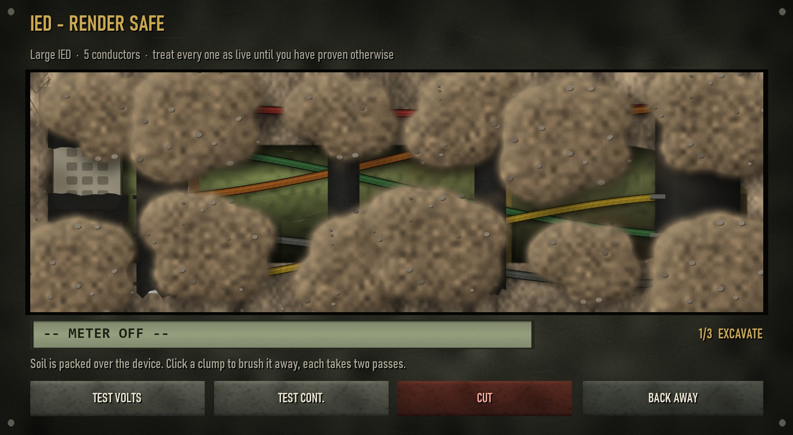
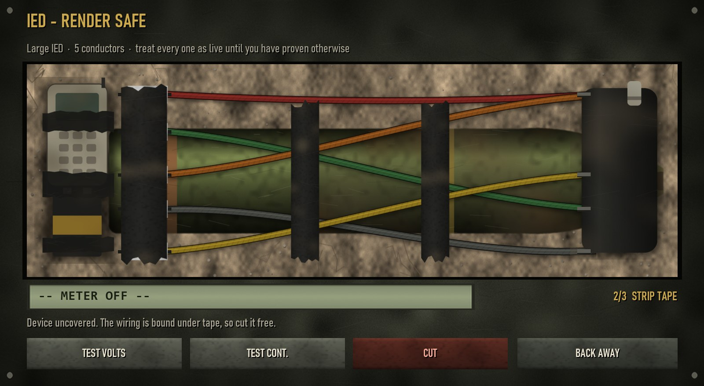
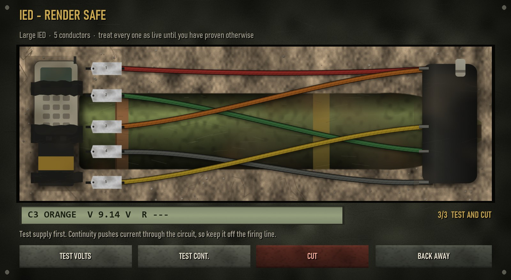
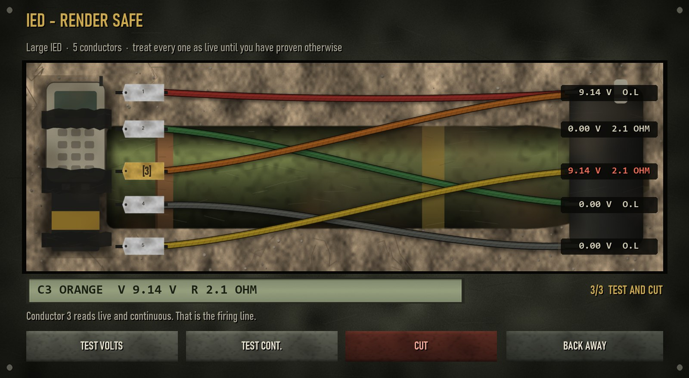
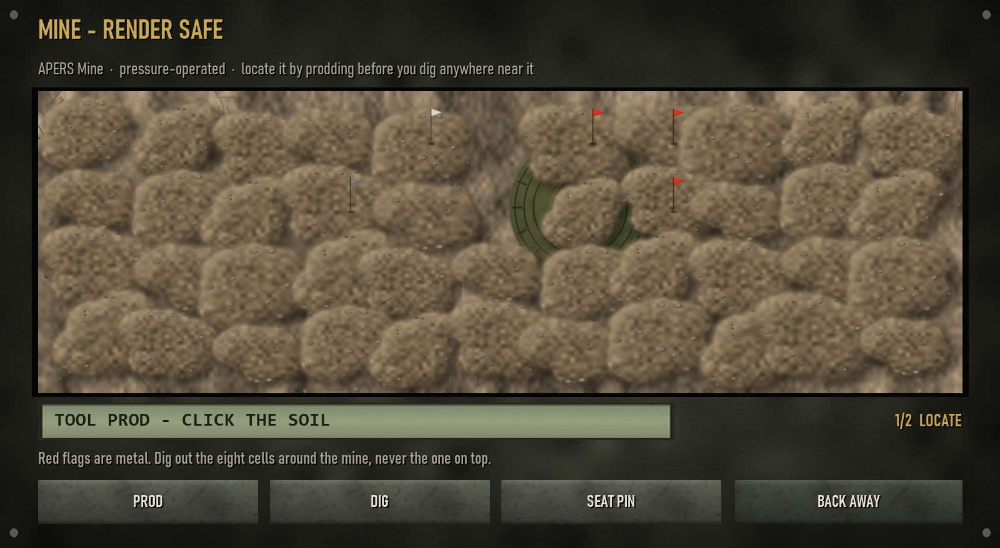
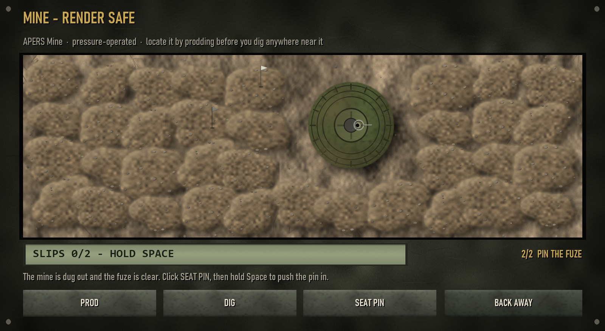
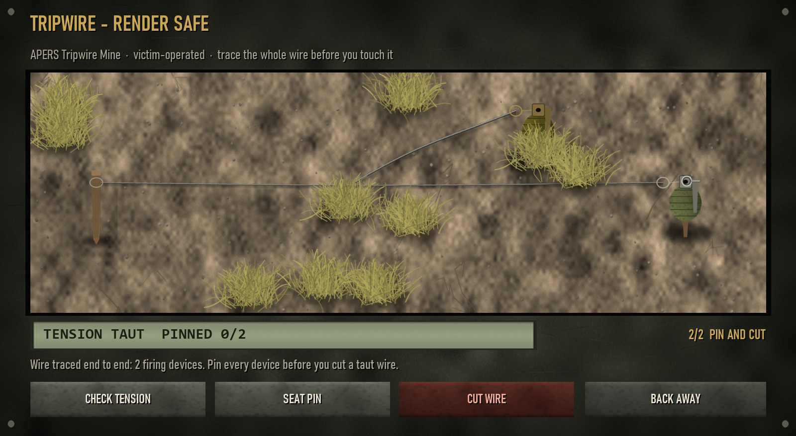
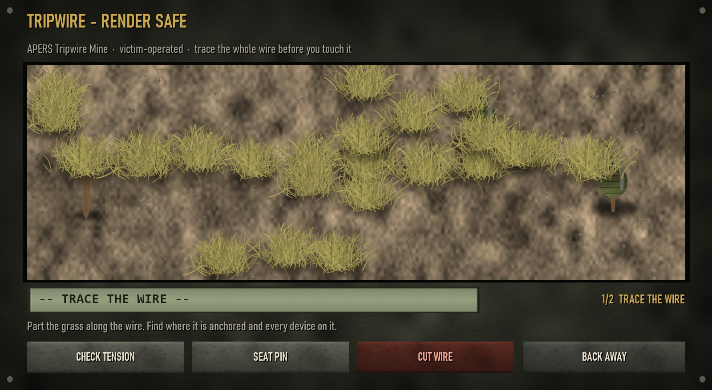

# Defusal guide

[← Back to README](../README.md)

TLB Interactions replaces ACE's defusal progress bar with a hands-on procedure.
You still need what ACE asks for (the defusal kit and, if the mission requires
it, the explosive specialist trait), and you still use ACE's **Defuse**
interaction. What changes is what happens after you click it.

- [Before you start](#before-you-start)
- [Which procedure](#which-procedure)
- [The board](#the-board)
- [IED](#ied)
- [Mine](#mine)
- [Tripwire](#tripwire)
- [The steady hand](#the-steady-hand)
- [When it goes wrong](#when-it-goes-wrong)
- [Quick reference](#quick-reference)

---

## Before you start

- **Progress lives on the device.** Every stage you finish (soil brushed, tape
  cut, readings taken, cells dug, tufts parted, pins seated) is stored on the
  explosive and shared with every player. Back off and come back, or let a team
  mate take over: the device is exactly as you left it.
- **Timed actions can't be interrupted.** While a brush, cut, reading or dig is
  in progress the board is locked and can't be closed. Once the pliers close on a
  wire, the outcome is already decided.
- **You have to stay with it.** The board closes if you die, get into a vehicle,
  or end up more than 6 m from the device.
- **Settings change the numbers.** Everything below uses the default settings
  at Normal difficulty. Your server may use different times, risks and difficulty. See [All settings](settings.md).

## Which procedure

The board's title tells you what you are working on: **IED**, **Mine** or
**Tripwire**. The mod decides by how the device fires:

| What fires it | Examples | Procedure |
| --- | --- | --- |
| Anything with *IED* in its class name | Urban and land IEDs, including victim-operated ones | IED |
| A wire you trip | Tripwire mines, trip flares | Tripwire |
| Pressure or proximity | AP mines, bounding mines, AT mines | Mine |
| Remote, timer, magnetic or IR | Demo charges, satchels, command-detonated claymores, SLAMs | IED. You are defeating a firing circuit |

Mission makers can force any explosive onto a procedure; see
[Device types](settings.md#interactive-defusal---device-types), or place an
[Explosive settings module](modules.md#explosive-settings).

## The board

Every board shares the same layout:

- **Title and subtitle:** the procedure and the explosive's name.
- **The device:** the working area. Click things on it.
- **LCD:** readings, the tool in hand, slips used, or the progress of the current
  action.
- **Stage:** which step you are on.
- **Three action buttons:** relabelled for each procedure (meter modes and cut;
  prod, dig and seat pin; tension, pin and cut wire).
- **Back away:** closes the board. Progress is kept.
- **Anti-tamper clock:** only when the server enables it.

---

## IED

An unmarked shell with a taped trigger pack, buried in soil. Three stages.

### 1. Excavate

The device is covered by twelve clumps of soil. **Click a clump to brush it.** Each takes **two passes** (0.6 s each by default): the first knocks it down to a
thin residue, the second clears it. When every clump is gone the stage moves on.

> Servers can switch burial off (*Devices are buried*), in which case you start
> at the tape, or turn on *Auto-clear dirt and grass* to have the soil brush itself
> away while you watch.

### 2. Strip the tape

Three strips of tape bind the wiring. **Click a strip to cut it** (1.4 s). The
strip across the numbered cable tags has to go before any conductor can be
reached.

### 3. Test and cut

Now the meter. The device has between **3 and 5 conductors** (more on harder
settings), each with a numbered tag on the left.

1. **Click a tag** (or press its number key) to clip the meter to it.
2. **Test volts:** does the conductor carry supply? Always safe.
3. **Test continuity:** does it reach the detonator? *Not* always safe (below).
4. **Cut** the one that is the firing line.

Nothing on the device marks the firing line: no labels, no colours, no traceable
route. Every conductor has two hidden properties, and they combine like this:

| Volts | Continuity | What it is |
| --- | --- | --- |
| `9.14 V` | `2.1 OHM` | **The firing line.** Exactly one. Cut this. |
| `9.14 V` | `O.L` | Live bus tap. Energised, but wired to nothing |
| `0.00 V` | `2.1 OHM` | Return path to the detonator body |
| `0.00 V` | `O.L` | Filler |

Every device has **at least one** live bus tap and **at least one** return path,
so neither reading on its own can ever settle it. Readings are **unlimited**. A
meter does not run out; readings only cost time (2.5 s each).

### Continuity has a cost

A continuity test pushes its own current through whatever it is clipped to. On
the firing line, that current goes through the detonator, and **one time in four
it fires it** (25% by default). Voltage tests are always safe.

### So prove it by elimination

1. Test **volts** on every conductor. Say **2** and **4** read `9.14 V`.
2. Test **continuity on 4**. It reads `O.L`: a dead-end bus tap.
3. So **2** is the firing line, and you never put continuity on it.

When only one live conductor is left unexplained, it is the firing line. Cut it.

---

## Mine

A pressure mine buried under a patch of soil: a grid of **11 × 4 cells**. The mine
itself sits under a **3 × 3 block** of cells: its **pressure plate** is the centre
cell and its **rim** is the eight around it. A few stones are buried elsewhere.

### 1. Locate with the prod

Choose **Prod** and click a soil cell (1.2 s). A flag marks what the prod touched:

| Flag | Means |
| --- | --- |
| White | Nothing there |
| Grey | A stone. Hard, but not the mine |
| Red | Metal. The mine's rim, or its plate |

**Prodding the plate is a gamble:** half the time (by default) it fires an
anti-personnel mine. Work inward from the edges of the soil, so the first metal
you find is the rim.

### 2. Dig around it, never on it

Choose **Dig** and click a cell (1.0 s) to remove its soil. Work out the middle of
the 3 × 3 block from your red flags, and **dig out the eight cells around it**.

> **Digging on the pressure plate fires an anti-personnel mine. Every time.**

When the whole rim is out, the loose soil over the fuze comes away with it and
the mine is ready for its pin.

### 3. Seat the pin

Press **Seat pin** and hold it in with a steady hand. See
[The steady hand](#the-steady-hand). When it seats, the mine is safe and ACE
finishes the defusal.

### Anti-tank mines

An AT mine needs far more weight than a hand to fire. Prodding its plate is a
small risk (15% of the AP chance) and digging onto it is survivable, which is
true of the real thing. Don't let that habit follow you onto an AP mine.

> With *Auto-clear dirt and grass* on, the rim digs itself out (never the plate)
> and prodding isn't needed. You go straight to the pin.

---

## Tripwire

A wire strung through grass from an anchor stake to a firing device. **Sometimes
the wire branches to a second device** (30% of the time by default), and nothing
tells you so until the whole wire is traced.

### 1. Trace the whole wire

**Click grass to part it** (0.7 s per tuft). The wire counts as traced once every
tuft over it (main wire and any branch) is gone; the LCD then tells you how
many devices it has. The grass won't give it away: stray tufts are everywhere,
and a wire without a branch still has a decoy line of tufts where a branch could
be.

### 2. Check the tension

Press **Check tension** (2 s). Do it before you touch anything else.

| Tension | Fuze | What it means for the cut |
| --- | --- | --- |
| **Taut** | Tension-release | Cutting releases the striker. **Pin every device first.** |
| **Slack** | Pull | Cutting is safe, pinned or not. Never pull it. |

### 3. Pin, then cut

Click a device to select it, then **Seat pin**: the same steady-hand pin as a
mine. When every device is safe, **Cut wire**.

> **A taut wire with any device unpinned fires when you cut it**, including the
> second device you didn't know about because you stopped tracing early.
>
> On a slack wire you can skip the pins entirely. That is faster and avoids their
> slip risk, but only if you checked the tension first. Cutting without checking
> is a coin flip.

---

## The steady hand

Mines and tripwire devices are made safe by seating a safety pin. Press **Seat
pin** and a gauge appears: a needle wandering across a track with a green band
in the middle, and a progress bar underneath.

1. **Hold to push.** Hold <kbd>Space</kbd> (rebindable, see [Keybinds](settings.md#keybinds)), or hold the **Seat pin** button. The
   pin goes in while you hold, but a hand under effort shakes, so the needle
   wanders much harder.
2. **Ease off before the edge.** Let go and the needle settles back towards the
   centre. Push while it is steady; release as it drifts toward the edge of the band.
3. **Slips cost you.** If the needle leaves the band while you are pushing, the
   pin **slips**: it loses 30% of its progress and your hand is locked out for a
   moment. At Normal difficulty **two slips are forgiven; the third fires the
   device.** Slips count per device and are kept if you back off.

A pin needs 4 s of steady pushing. Hold without ever letting go and it will slip
in under two seconds; ease off at about two-thirds of the band and it seats in
around eight seconds with no slips at all. **Rhythm, not reflex.**

---

## When it goes wrong

What happens after a mistake depends on the server's *Wrong conductor* setting:

| Setting | Cutting the wrong conductor |
| --- | --- |
| **Detonate immediately** (default) | The device fires. |
| **Arm a short countdown** | The device arms, and you have a few seconds (4 by default) to get clear. |
| **One spare cut, then detonate** | The first wrong cut only kills that conductor; the next wrong cut fires it. |

Some things always fire the device, whatever that setting says: the continuity
test going through the detonator, prodding or digging a live pressure plate,
running out of slips on a pin, cutting a taut tripwire with a device unpinned,
and the anti-tamper clock (when enabled) running out.

The **anti-tamper clock** counts hands-on time only, and it is banked on the device:
backing off pauses it, but coming back does not reset it.

---

Board images are rendered from the mod's own textures and board layout. In game the board opens over the game view.

---

## Quick reference

**IED**
- Soil, then tape, then the meter.
- Volts on everything first. Always safe.
- Continuity only on live conductors; prove the last one by elimination.
- Cut the one that is live **and** continuous.

**Mine**
- Prod from the edges inward.
- Red flags are the rim; the plate is the middle of the 3 × 3.
- Dig the eight around it. Never dig the middle.
- Seat the pin with a steady hand.

**Tripwire**
- Trace the whole wire. There may be a second device.
- Check the tension before anything else.
- Taut: pin every device, then cut.
- Slack: cutting is safe. Never pull.
